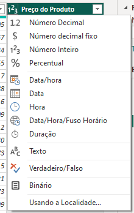
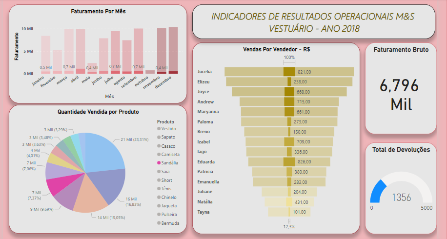

# PowerBi - Criação de Dashboard de Indicadores de Vendas

  Power Bi é uma ferramenta da Microsoft para Business Intelligence. Disponível para download em:
  
  https://powerbi.microsoft.com/pt-br/desktop/

*** 

### Conceitos Importantes  
  
  *DADOS* - são códigos que constituem a matéria prima da informação, ou seja, é a informação não tratada que ainda não apresenta relevância;
  
  *INFORMAÇÃO* - são dados tratados, ou seja, o resultado do processamento de dados, que podem contribuir no processo de tomadas decisões;
  
  *CONHECIMENTO* - é o ato ou efeito de abstrair ideia ou noção de alguma coisa.
  
  *FONTE DE DADOS* - é o local onde são armazenados os dados que serão coletados por programas de computador(softwares) para então serem 
  transformados nas informações que irão ajudar uma determinada área ou algumas áreas de negocio da empresa.
  
  *ENTIDADE* -  é uma representação de um conjunto de informações sobre determinado conceito de sistema.(TABELA) Toda entidade possui atributos,
  que são as informações que referenciam a entidade.(COLUNAS) Toda entidade possui tuplas, que é praticamente cada linha formada por uma lista
  ordenada, os próprios registros. (LINHAS)

  *RELACIONAMENTOS* - em geral são nomeados com verbos ou expressões que representam a forma como as entidades interagem , ou ação que uma exerce
  sobre a outra.

  *CARDINALIDADE* - é um número que expressa o comportamento(número de ocorrências) de determinada entidade associada a uma ocorrência da entidade
  em questão através do relacionamento entre elas.
          
  *DASHBOARD* - é um painel visual que apresenta, de maneira centralizada, um conjunto de informações: indicadores e suas métricas; Por meio desse conjunto
  de dados e painéis disponíveis, é possível planejar e implementar melhorias nos processos, corrigir falhas, pensar novas estratégias e tomar decisões.
  Dessa forma, eis os processos de construção de um BI:
    
       * Iniciamos sempre com a extração dos dados que pode ser de diversas fontes;
       * Esses dados serão passados para uma ferramenta de ETL(Extração, Transformação e Carregamento dos Dados);
       * Desta forma, os dados serão tratados e, deixados armazenados. Facilitando a futura análise;
       * Depois, por meio das ferramentas de BI, fazemos a modelagem de dados e, por fim, iremos gerar nossos relatórios e indicadores.
  
***  
  
### Mãos a obra...
  Iniciamos nosso projeto abrindo o PowerBi Desktop. Aqui trabalharemos dois bancos de dados na extensão (xlsx). 
  
Link para acesso aos arquivos xlsx:
 
° https://github.com/adalto2019/PowerBi_Dashboard_/blob/main/Arquivos/Base%20Cliente.xlsx

° https://github.com/adalto2019/PowerBi_Dashboard_/blob/main/Arquivos/Base%20Devolu%C3%A7%C3%A3o.xlsx

Link para acesso aos arquivo ProjetoBi.pbix:

° https://github.com/adalto2019/PowerBi_Dashboard_/blob/main/Arquivos/ProjetoBi.pbix
    

**Img da tela inicial do PowerBi.**    
    
  Na seguência efetuaremos primeiramente o tratamento dos dados disponivéis, clicando em obter dados(1)/tipo de dado da extensão/selecionando o caminho do arquivo e    selecionando ele (os arquivos utilizados aqui estão nomeados como: Base Cliente e Base Devolução). Após isso na tela que se abrirá(2), selecionar o arquivo e em       seguida: transformar dados(botão na parte inferior). Após isso, abrirá o editor de Power Querry do arquivo para tratamento. Aqui verificaremos se os tipos de dados     estão compatíveis com os dados de cada coluna, ex: Nome, tipo texto; quantidade vendida, tipo, numero, e assim por diante. Os dados que não estiverem compativéis, corrigiremos clicando sobre o ícone do tipo do dado(3) e selecionando o tipo correto.
  
 *(2) 

 *(3)  *(1) 

  Próxima etapa, verificaremos se existe no banco de dados linhas em branco ou com erros. Para isso selecionaremos: reduzir linhas/remover linhas(4) e selecionar a      execução de cada ação.(uma forma de verificar se exsite linhas em branco, com erro, etc. É clicando na seta ao lado do título de cabeçalho de cada coluna).
Verificado que os dados estão todos ok, com as devidas transfomações feitas. Iremos fechar e aplicar o que foi realizado, através do ícone: fechar e aplicar(5).
Pronto, o arquivo esta salvo com as transformações realizadas, agora repetiremos o mesmo passo para o outro arquivo xlsx: Base Devolução. 
  Pós transformar os dados, eles ficarão disponivéis na aba Dados(lado superior direito). Caso queira, você pode renomear os dados transformados. Aqui utilizaremos o títulos renomeados: DadosProdutos e DadosDevolução. Para isso, basta clicar: .../remomear/Enter. No lado esquerdo da tela o arquivo transformado também estrá disponível em três exibições: exibição de relatório; exibição de dados e exibição de modelo(6). 
  
 *(4)  *(5)  *(6)
   
     Nota: Para esse exercício criaremos um Dashboard com os seguintes gráficos.
     
     1°. Gráfico de barra horizontal com os dados de faturamento mês de todo o ano.
     2°. Gráfico pizza com os dados de venda de quantidade vendida por produto.
     3°. Gráfico de hierárquia com os dados de vendas por vendedor.
     4°. Criar indicadores de quantidades de devoluções ocorridas no ano e faturamento total.

Em exibição de relatório criaremos nosso Dashboard com a proposta mencionada acima. Em vizualizaçãoes(7) selecionaremos o ícone do gráfico que melhor atenda ao primerio quesito. Aqui utilizaremos: 'Gráfico de coluna clusterizado', dando um clique sobre ele. Na seguência o modelo do gráfico aparecerá vázio na área de exibição de relatório. Para adicionarmos os dados que se pede ao gráfico vázio, clicaremos sobre ele. Em visualizações aparecerá as informações de eixo a serem preenchidas(8).

 *(7),(8)

    Nota:
      Eixo X - Dados disposto na horizontal
      Eixo Y - Dados disposotos na vertical

***

### Criando o 1° Gráfico:
  Para adicionarmos os dados de venda mês a mês no eixo X, selecionaremos o arquivo: 'DadosProdutos' que renomeamos, seguida da coluna 'Data da Venda'. Aqui, selecionaremos esse arquivo e o arrastaremos para o eixo X(9). Após isso, perceberemos que o campo eixo X, ficará prrenchido com várias informações. Como o nosso intereese e maracar o gráfico apenas com informaçãoes do mês, eliminaremos clicando no 'x' as informações de: 'Ano', 'Trimestre' e 'Dia'. Já no eixo Y, adicionaremos, clicando e arrasatndo, a coluna 'Quantidade Vendida'. Note que após isso o gráfico já estará configurado com as informações adicionadas nos eixos X e Y (10).

 *(9)  *(10)

  Refinando o gráfico récem criado, podemos executar algumas mehorias visuais, por exemplo:
  - Adicionando/Alterando o título do gráfico: com o gráfico selecionado - Visualizações/Formatar seu visual/Geral/Título/Texto do Título.
  - Criar/Alterar Título no eixo Y: com o gráfico selecionado - Visualizações/Eixo Y/Título/Texto do Título.
  - Arredondar as Bordas: com o gráfico selecionado - Visualizações/Formatar seu visual/Geral/Efeitos/Fronteira visual/Cantos arredondados(px).
  - Criar hierárquia de cores nas colunas do eixo X: com o gráfico selecionado - Visualizações/Formatar seu visual/Visual/Colunas/Cores
    (Aqui você pode definir a hierárquia de cores manual ou definir uma função de variação de cor por hierárquia).
  
  Obs. Durante os processos acima, você já pode ir modificando as cores e as características das fontes como: tamanho, estilos, etc..  
    

  
***  
  
### Criando o 2° Gráfico:
  Iniciaremos o segundo gráfico dando um clicque sobre o ícone do gráfico: 'Gráfico de pizza' na aba visualizações. Após isso, selecionaremos o gráfico vázio na área exibição de relatório e selecionaremos a tabela que renomeamos: 'DadosProdutos', clicando e arrastando a coluna 'Quantidade vendida' para o campo 'Valores', e a coluna 'Produto' para o campo 'Legenda' da aba Visualizações(12). Note que após isso o gráfico já estará configurado com as informações adicionadas nos campos Legenda e Valores.
  
  
  
  Refinando o gráfico récem criado, podemos executar algumas mehorias visuais, seguindo as mesmas orientações aplicadas no 1° Gráfico.
  

***

### Criando o 3° Gráfico:
  Para criarmos o terceiro gráfico, daremos um clique sobre o ícone: 'Funil' na aba visualizações. Após isso, selecionaremos o gráfico vázio na área exibição de relatório e selecionaremos a tabela que renomeamos: 'DadosProdutos', clicando e arrastando a coluna 'Nome' para o campo 'Categoria', e a coluna 'Quantidade Vendida' para o campo 'Valores' na aba Visualizações. Note que após isso o gráfico já estará configurado com as informações adicionadas nos campos Categoria e Valores.

  Refinando o gráfico récem criado, podemos executar algumas mehorias visuais, seguindo as mesmas orientações aplicadas no 1° Gráfico.
  

### Criando os demais indicadores:
Para os demais indicadores utilizaremos dois icones um de 'indicador' e outro 'Cartão'. No ícone indicador, adicionaremos a coluna: 'Quantidade devolvida' da tabela 'DadosDevolução', onde ficará regitrado o total de todas as devoluções. No segundo indicador, 'Cartão', adiconaremos os dados da coluna 'Quantidade vendida' da tabela 'Dados Produtos'. Para que os dados de quantidade devolvida se comuniquem com os demais gráficos da planilha, criaremos uma relação entre as tabelas: 'DadosProdutos' e 'DadosDevolução', clicando em exibição de modelo e criando uma cardinalidae entre 'Data da venda' nas duas planilhas. Para isso basta clicar e arrastar uma 'Data da venda' em uma planilha até a outra. Após isso, podemos voltar a exibição de relatório e configurar os dois indicadores recém criados conforme orientações vistas no desenvolvimento do primeiro gráfico.    

***

### Refinando as configurações do Dashboard recém criado:

  Após a criação do gráficos propostos, podemos refinar os gráficos récem criados executando algumas mehorias visuais, por exemplo: 

  - Adicionar título ao dashboard: inserir/Caixa de texto.
  - Modificando a cor da Tela de fundo: Selecionando a página de fundo - Visualizações/Formatar sua página do relatório/Tela de fundo(aqui você pode adicionar uma cor ou mesmo uma img).
  
### Dashboard - Visão Geral:  
  

### Dashboard - Indicadores Mês/Setembro 2018:  

### Dashboard - Indicadores Dados Produto Vendido/Sandália:

### Dashboard - Indicadores Dados do Vendedor 'Breno':

***

### Autor
    Adalto Carvalho Ribeiro Simão Junior - Março 2023.

